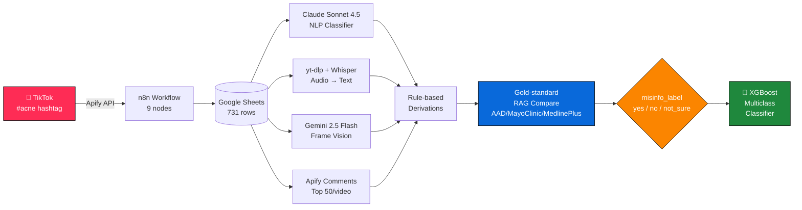

<div align="center">

# 🧴 TikTok Acne Misinformation Detection
### *From scraping 731 viral skincare videos to a clinically-grounded ML classifier*

<p>
  
  
  
  
  
</p>

<p>
  
  
  
  
  
  
</p>

**End-to-end pipeline** • TikTok → Apify → Claude → Whisper → Gemini Vision → XGBoost
**Ground truth** • AAD · MayoClinic · MedlinePlus clinical guidelines

</div>

---

## 📚 Table of Contents

<details open>
<summary><b>Click to expand / collapse</b></summary>

- [🎯 The Problem](#-the-problem)
- [🧪 Why This Matters](#-why-this-matters)
- [🏗️ Architecture at a Glance](#️-architecture-at-a-glance)
- [⚙️ The Five-Phase Pipeline](#️-the-five-phase-pipeline)
- [📊 Dataset](#-dataset)
- [🤖 Model Card — XGBoost](#-model-card--xgboost)
- [📈 Headline Results](#-headline-results)
- [🔍 What the Model Learned](#-what-the-model-learned)
- [🗂️ Repository Layout](#️-repository-layout)
- [🚀 Quickstart](#-quickstart)
- [🔑 API Keys & Costs](#-api-keys--costs)
- [🧠 Misinformation Taxonomy (13 categories)](#-misinformation-taxonomy-13-categories)
- [⚠️ Limitations & Ethics](#️-limitations--ethics)
- [🙋 FAQ](#-faq)
- [📜 Citation](#-citation)

</details>

---

## 🎯 The Problem

> **TikTok is the new dermatology clinic for Gen Z** — and most of the advice is wrong.

Searches for `#acne`, `#skincare`, `#hormonalacne` return billions of views. Creators promote toothpaste spot-treatments, "gut-cleanse cures," $30 LED masks, and *anti-Accutane* fearmongering — often outranking board-certified dermatologists in the algorithm.

This project asks one question:

> **Can a machine reliably distinguish clinically-grounded acne content from misinformation, using only what TikTok exposes?**

---

## 🧪 Why This Matters

| Stakeholder | Why they care |
|---|---|
| 🧑‍⚕️ **Dermatologists** | Patients arrive with self-inflicted chemical burns, hyperpigmentation, or worsened acne from DIY trends |
| 📱 **Platforms** | Need scalable moderation signals that don't require manual MD review of every video |
| 🔬 **Researchers** | Lack a labeled corpus of acne misinformation — this project ships one |
| 👨‍👩‍👧 **Users** | Deserve to know when an advice video conflicts with AAD guidelines |

---

## 🏗️ Architecture at a Glance



---

## ⚙️ The Five-Phase Pipeline

<table>
<tr>
<th>Phase</th><th>What happens</th><th>Tool</th><th>Output</th>
</tr>
<tr>
<td><b>1. Scrape</b></td>
<td>Pull video metadata, captions, hashtags, creator bios from <code>#acne</code> & related tags</td>
<td>n8n + Apify TikTok scraper</td>
<td>731 raw rows</td>
</tr>
<tr>
<td><b>2. NLP Classify</b></td>
<td>Caption + creator-type → 11 labels (claim_type, accuracy, treatment origin, gender, country, etc.)</td>
<td>Claude Sonnet 4.5 (structured JSON)</td>
<td>11 labeled cols</td>
</tr>
<tr>
<td><b>3. Transcribe</b></td>
<td>Download audio with yt-dlp (using session cookies), Whisper-base on CPU, then summarize</td>
<td>yt-dlp + Whisper + Claude summarizer</td>
<td>676 / 731 transcripts</td>
</tr>
<tr>
<td><b>4. Vision</b></td>
<td>Sample frames → Gemini extracts 12 visual features (face visibility, shot complexity, before/after, etc.)</td>
<td>Gemini 2.5 Flash</td>
<td>12 visual cols</td>
</tr>
<tr>
<td><b>5. Derive + Verify</b></td>
<td>8 rule-based derivations (recurrence, brand, ingredient), then compare each claim against AAD/Mayo/MedlinePlus gold standard</td>
<td>Python + RAG corpus</td>
<td><code>misinfo_label</code></td>
</tr>
</table>

> **Total spend:** ~$5–10 Apify + ~$0.10–$4 Claude. Whisper + Gemini run free.

---

## 📊 Dataset

<p align="center">

| | |
|---:|:---|
| **Videos** | 731 |
| **Transcripts** | 676 (92.5%) |
| **Comments scraped** | ~36k (top 50 per video) |
| **Final feature columns** | 54 raw → 38 ML-ready |
| **Gold-standard sources** | AAD · MayoClinic · MedlinePlus |
| **Class distribution** | `no` 48.0% · `yes` 44.6% · `not_sure` 7.4% |
| **Time period** | 2024–2026 viral skincare content |

</p>

📁 **Files of interest** (in `data/`):
- `Finalized Dataset.csv` — 731×54 final labeled table
- `TikTok_Acne_Misinfo_GoldStd.xlsx` — gold-standard verified subset
- `ML_COMPLETE_REPORT.md` — full XGBoost write-up
- `EDA_Complete_Report.zip` · `XGBoost_Final_Charts.zip` — generated plots

---

## 🤖 Model Card — XGBoost

<details>
<summary><b>📦 Why XGBoost (and not the alternatives)</b></summary>

| Model | Verdict |
|---|---|
| **XGBoost** ✅ | Tabular SOTA, handles class imbalance, robust to multicollinearity (`views↔likes r=0.91`) |
| Neural Network ❌ | 731 rows is ~14× too few |
| Naive Bayes ❌ | Assumes feature independence — violated |
| LDA/QDA ❌ | All features non-normal |
| LightGBM ❌ | Built for 100K+ rows |

</details>

<details>
<summary><b>⚙️ Hyperparameters (final config)</b></summary>

```python
XGBClassifier(
    objective='multi:softprob',
    num_class=3,
    n_estimators=200,
    max_depth=3,              # shallow → prevents memorization
    learning_rate=0.05,       # slow learning → better generalization
    subsample=0.7,
    colsample_bytree=0.7,
    min_child_weight=10,
    gamma=0.5,
    reg_alpha=1.0,            # L1
    reg_lambda=5.0,           # L2
    early_stopping_rounds=30,
)
```

**Class weights:** `no`=0.69 · `not_sure`=4.59 (6.6× upweighted) · `yes`=0.75

</details>

---

## 📈 Headline Results

<table align="center">
<tr><th></th><th>Train</th><th>Test</th><th>5-Fold CV</th></tr>
<tr><td>Accuracy</td><td>84.7%</td><td><b>70.1%</b></td><td>76.7% ± 2.5%</td></tr>
<tr><td>F1 (macro)</td><td>0.814</td><td><b>0.593</b></td><td>0.542 ± 0.029</td></tr>
<tr><td>F1 (weighted)</td><td>0.851</td><td><b>0.708</b></td><td>—</td></tr>
<tr><td>AUC-ROC (macro)</td><td>—</td><td><b>0.797</b></td><td>—</td></tr>
</table>

### Per-class on test set

| Class | Precision | Recall | F1 | AUC | Support |
|---|---:|---:|---:|---:|---:|
| 🟢 `no` (verified) | 0.75 | 0.71 | 0.73 | 0.794 | 106 |
| 🔴 `yes` (misinfo) | 0.76 | 0.76 | **0.76** | **0.803** | 98 |
| 🟡 `not_sure` (mixed) | 0.25 | 0.35 | 0.29 | 0.714 | 17 |

> **Overfit gap shrunk 25.7% → 14.6%** after regularization — model is no longer memorizing.

---

## 🔍 What the Model Learned

### Top 10 features by importance

```
claim_accuracy         ████████████████████████████  0.096
claim_type             ████████████████              0.053
label_confidence       ███████████████               0.049
unrealistic_claim_flag █████████████                 0.042
country_origin         ████████████                  0.039
No._people_video       ███████████                   0.037
intent_clarity         ███████████                   0.036
video_format           ██████████                    0.035
treatment_type         ██████████                    0.032
before_after_claim     █████████                     0.031
```

✅ **Alignment with EDA**: top XGBoost features mirror Cramér's-V top predictors from independent EDA (`claim_type` V=0.451, `claim_accuracy` V=0.364, `country_origin` V=0.386).

### Confusion (% normalized)

| ↓ actual / → predicted | `no` | `not_sure` | `yes` |
|---|---:|---:|---:|
| **`no`** | **70.8%** | 10.4% | 18.9% |
| **`not_sure`** | 47.1% | **35.3%** | 17.6% |
| **`yes`** | 17.3% | 7.1% | **75.5%** |

> Most confusion is the genuinely-hard `no ↔ yes` boundary — videos that name an approved ingredient (sunscreen) *and* an unsupported one (gut-cleanse) in the same clip.

---

## 🗂️ Repository Layout

```
📦 TikTok-Acne-Misinformation
├── 📁 code/                          ← All scripts + notebooks
│   ├── tiktok_apify_workflow_v8.json    Phase 1 · n8n scrape
│   ├── classify_videos_v2.py            Phase 2 · Claude NLP (11 cols)
│   ├── download_and_transcribe.py       Phase 3 · yt-dlp + Whisper
│   ├── transcript_summary.py            Phase 3 · 1-2 sent summaries
│   ├── video_analytics.py               Phase 4 · Gemini frame vision
│   ├── scrape_comments.py               Phase 5 · Apify comments
│   ├── final_derivations.py             Phase 5 · 8 rule derivations
│   ├── misinfo_classifier.py            Phase 5 · AAD/FDA compare
│   ├── acne_scraper_v2.py               Pull AAD + NLM guidelines
│   ├── run_pipeline.py                  Master orchestrator
│   ├── Copy of TikTok_Acne_Pipeline_v3.ipynb
│   ├── EAD + Logistic Regression.ipynb
│   └── README.md
│
├── 📁 data/                          ← Datasets + reports
│   ├── Finalized Dataset.csv            Final 731×54 labeled
│   ├── TikTok_Acne_Misinfo_GoldStd.*    Gold-standard verified
│   ├── ML_COMPLETE_REPORT.md            XGBoost write-up
│   ├── *.zip                            EDA + chart bundles
│   └── Misc/                            Intermediate checkpoints
│
├── 📁 gold_standard_sources/         ← Clinical ground truth
│   ├── AAD/                             American Academy of Dermatology
│   ├── MayoClinic/                      Mayo Clinic acne guidance
│   └── MedlinePlus/                     NIH MedlinePlus articles
│
├── 📁 presentation/                  ← Stakeholder slide deck
│   └── Presentation_.pptx
│
├── 📁 videos/                        ← 133 raw TikTok .mp4 ⚠️ gitignored
│
├── .gitignore
└── README.md                         ← you are here
```

> ⚠️ **`videos/` is excluded from Git** (1.4 GB, contains files > 100 MB). To reproduce vision/transcription steps, re-scrape via `code/tiktok_apify_workflow_v8.json` — video IDs are in `data/Finalized Dataset.csv → video_id`.

---

## 🚀 Quickstart

### 1. Clone

```bash
git clone https://github.com/<your-user>/tiktok-acne-misinformation.git
cd tiktok-acne-misinformation
```

### 2. Install

```bash
pip install -r requirements.txt   # or:
pip install anthropic yt-dlp openai-whisper google-generativeai \
            Pillow requests beautifulsoup4 python-docx xgboost \
            pandas scikit-learn matplotlib seaborn
```

Plus **ffmpeg** on PATH (audio decode):
```bash
# Windows
winget install Gyan.FFmpeg
# macOS
brew install ffmpeg
# Linux
sudo apt install ffmpeg
```

### 3. Set API keys

```bash
# .env (gitignored)
ANTHROPIC_API_KEY=sk-ant-...
APIFY_TOKEN=apify_api_...
GOOGLE_API_KEY=AIza...
```

### 4. Run a phase

<details>
<summary><b>📡 Phase 2 — Classify captions</b></summary>

```bash
python code/classify_videos_v2.py \
  --input "data/TikTok_Acne_FINAL.xlsx" \
  --output classified.csv \
  --api-key $ANTHROPIC_API_KEY \
  --limit 5      # smoke test first
```
</details>

<details>
<summary><b>🎙️ Phase 3 — Transcribe</b></summary>

```bash
python code/download_and_transcribe.py \
  --input  data/TikTok_Acne_FINAL.xlsx \
  --output transcribed.csv \
  --cookies cookies.txt \
  --model base \
  --resume
```
See `data/Misc/SETUP_GUIDE.md` for cookies + Whisper sizing.
</details>

<details>
<summary><b>👁️ Phase 4 — Vision</b></summary>

```bash
python code/video_analytics.py \
  --input transcribed.csv \
  --videos-dir videos/ \
  --output vision.csv
```
</details>

<details>
<summary><b>🤖 Phase 5 — Train XGBoost</b></summary>

Open `code/EAD + Logistic Regression.ipynb` (despite the name, contains the XGBoost section) and run all cells.
</details>

---

## 🔑 API Keys & Costs

| Service | Purpose | Tier | Approx cost |
|---|---|---|---|
| **Anthropic Claude** | NLP classification, summaries | Pay-as-go | $0.10 – $4 total |
| **Apify** | TikTok metadata + comments scraping | Pay-as-go | $5 – $10 total |
| **Google Gemini** | Frame vision analysis | Free tier | $0 |
| **OpenAI Whisper** | Local transcription | Free (CPU/GPU) | $0 |

> Total project cost: **under $15**.

---

## 🧠 Misinformation Taxonomy (13 categories)

<table>
<tr><th>#</th><th>Category</th><th>Verdict</th></tr>
<tr><td>1</td><td><code>dietary_cure_dairy</code></td><td>🟡 Partially supported</td></tr>
<tr><td>2</td><td><code>dietary_cure_sugar</code></td><td>🔴 Unsupported</td></tr>
<tr><td>3</td><td><code>gut_health</code></td><td>🔴 Unsupported as primary tx</td></tr>
<tr><td>4</td><td><code>diy_topicals</code> (toothpaste, garlic)</td><td>⛔ False & harmful</td></tr>
<tr><td>5</td><td><code>diy_chemical_peels</code> (30% glycolic)</td><td>⛔ Dangerous</td></tr>
<tr><td>6</td><td><code>anti_isotretinoin</code></td><td>🔴 Misleading</td></tr>
<tr><td>7</td><td><code>hormone_supplement</code> (DIM, spearmint)</td><td>🔴 Unsupported</td></tr>
<tr><td>8</td><td><code>ice_therapy</code></td><td>🔴 Not evidence-based</td></tr>
<tr><td>9</td><td><code>led_device</code></td><td>🟡 Partial — mild only</td></tr>
<tr><td>10</td><td><code>sunscreen_anti</code></td><td>⛔ False & dangerous</td></tr>
<tr><td>11</td><td><code>unverified_routine</code> (K-beauty as cure)</td><td>🟡 Varies</td></tr>
<tr><td>12</td><td><code>ayurvedic_traditional</code></td><td>🟡 Limited evidence</td></tr>
<tr><td>13</td><td><code>clinically_accurate</code> (retinoids, BPO, SA)</td><td>✅ Supported</td></tr>
</table>

---

## ⚠️ Limitations & Ethics

<details>
<summary><b>📉 Where the model is weak</b></summary>

- **`not_sure` class (F1=0.29)** — only 54 training samples; mixed-treatment videos are genuinely ambiguous
- **14.6% train→test gap** — inherent to small N + tree depth tradeoff
- **English-bias** — Whisper + Claude prompts assume English captions; multilingual videos under-represented
- **Snapshot-in-time** — TikTok algorithm + trends rotate fast; 2024–2026 corpus may stale within a year
</details>

<details>
<summary><b>🧭 Intended use</b></summary>

✅ **Do**
- Screening tool for human reviewers
- Research into health-misinfo dynamics
- Platform-side ranking signals (in combination with other safeguards)

❌ **Don't**
- Auto-takedown without human review
- Single-source medical advice
- Apply outside the acne/skincare domain without retraining
</details>

<details>
<summary><b>🔐 Data ethics</b></summary>

- All videos collected from **public** TikTok posts via Apify
- Creator usernames retained for traceability but dropped before ML training
- No PII beyond what creators publicly displayed
- Comments scraping respected per-video rate limits
- Cookies file used only for download-throttle avoidance, never shared
</details>

---

## 🙋 FAQ

<details>
<summary><b>Q: Why not GPT-4o or Gemini for classification?</b></summary>

Claude's JSON-mode reliability and the 200K context window made it the most consistent for the 13-category taxonomy. We tested all three; Claude returned the fewest schema-violating outputs.
</details>

<details>
<summary><b>Q: Can I retrain on a different topic (e.g., hair loss misinformation)?</b></summary>

Yes — swap the gold-standard sources, rewrite the taxonomy prompt in `classify_videos_v2.py`, and the pipeline transfers as-is. Plan on relabeling at least 500 samples to retain F1 > 0.65.
</details>

<details>
<summary><b>Q: Where are the videos?</b></summary>

`videos/` is `.gitignored` (1.4 GB, several files >100 MB). Re-scrape using `code/tiktok_apify_workflow_v8.json` + the `video_id` column of `data/Finalized Dataset.csv`.
</details>

<details>
<summary><b>Q: How long does the full pipeline take end-to-end?</b></summary>

~3–4 hours on a modern laptop (Whisper-base CPU is the bottleneck — ~7s × 731 videos ≈ 1.5h alone).
</details>

---

## 📜 Citation

If this work informs your research, please cite:

```bibtex
@misc{tiktok_acne_misinfo_2026,
  title  = {From Scraping to Insights: A Multimodal ML Pipeline for
            Detecting Acne Misinformation on TikTok},
  author = {Parth, Ily and collaborators},
  year   = {2026},
  url    = {https://github.com/<your-user>/tiktok-acne-misinformation}
}
```

---

<div align="center">

**Built with** 🩹 Claude · 👁️ Gemini · 🎙️ Whisper · 🌲 XGBoost
*Patient screens, not patient verdicts — always defer to a board-certified dermatologist.*

<sub>⭐ Star this repo if it helped your research</sub>

</div>
